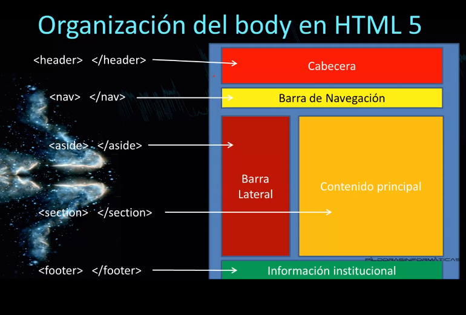
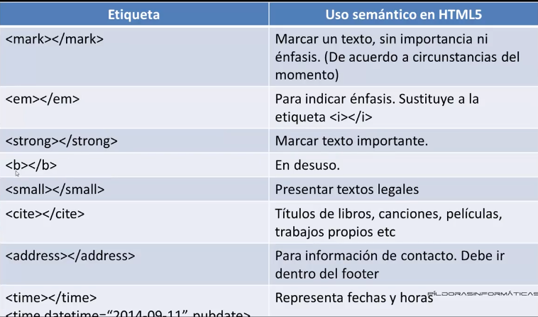

# Curso Básico de HTML 5

## ¿Que es HTML 5?
Es un standard que aúna a tres tecnologías HTML(le llaman lenguaje de etiquetas),
CSS() y Javascript.

HTML: Estructura
CSS: Apariencia
Javascript: Interactividad y animación

__<!DOCTYPE html>:__ Etiqueta para especificar que se trabajará con HTML5.

__head:__ La información de esta etiqueta no se ve, esta cabecera sirve para incluir información como:
hojas de estilo, archivos javascript internos, iconos, títulos, etiquetas meta.

__meta charset="utf-8":__ Especifica como será presentado el texto de la página web en pantalla.

__title :__ Cambia el texto de la pestaña del navegador. Para que la página la indexe bien porque el navegador la indexe por palabras
si escribes en la casilla de búsqueda HTML5 y lo filtrará.

__link :__ Sirve par enlazar documentos y hojas de estilo.

## Figure y figcaption

__figure :__ Insertar elementos independientes pero estan relacionados pueden ir imagenes, videos etc..
Para formatos en la etiqueta __img__ se aceptan png(8 y 16 bits), jpg(milomes de colores), gif(256 colores).
Los __gifs y png__ admiten la transpareccia.

__figcaption :__  Se usa para poner la descripción que llevará la imagen.

## Colocar el CSS

1. En un archivo independiente  : Archivo independiente con extensión CSS.
2. En la cabecera del documento HTML : Dentro de la etiqueta head.
3. Dentro de la etiqueta : Estilo inline. Casos muy concretos.

__Modelo caja contenedor__
Hay dos tipos de etiquetas en HTML
- Etiquetas Block : Generán un salto arriba y abajo y ocupan un 100% del ancho.
- Etiquetas inline: No generan un salto de línea.

La mayoría de las etiquetas de estructura son etiquetas block.

__Selectores__

- __selector de etiqueta__: Se usa el nombre de una etiqueta html por ejemplo body,header etc..
- __Selector de id__: Para aplicar apariencia a un único elemento un elementos con el #.
- __Selectores de clase__: 
